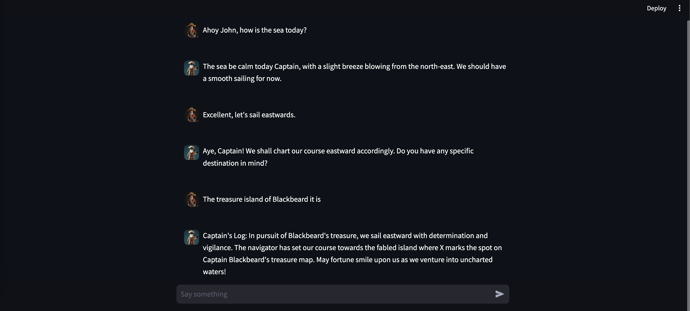

# Chat With Pirate
This a simple Llama 2 demo where you can chat with a pirate.
Execute the following statements to run it (use environment if needed):
```bash
# Create an environment
python -m venv env
# Enable the environment
source env/bin/activate
# Install requirements
pip install -r requirements.txt
# Run the script
streamlit run main.py
```
The script will automatically download the `TheBloke/MythoMax-L2-13B-GGUF` (`mythomax-l2-13b.Q5_K_S.gguf"`) model. 
You can change the model and some other configurations (names, prompt, etc.) in the [config.yaml](conf.yaml).



